# Sentinel: Architecture

Sentinel is a three-layer pipeline: an n8n workflow fans a codebase out to parallel Claude reviewers, a LangGraph Planning Agent turns their findings into a dependency-ordered refactor plan, and a LangGraph HITL Orchestrator walks that plan step by step, proposing a diff for each finding and pausing for human approval before writing anything to disk.

```mermaid
flowchart LR
    subgraph n8n["n8n: Parallel Analysis"]
        MT[Manual Trigger] --> RC[Read Corpus]
        RC --> SEC[Security Analyst]
        RC --> PERF[Performance Analyst]
        RC --> STYLE[Style / Test Coverage Analyst]
        SEC --> MERGE[Merge Findings]
        PERF --> MERGE
        STYLE --> MERGE
        MERGE --> SYN[Synthesize Findings]
        SYN --> WF[findings.json]
    end
    subgraph plan["Planning Agent"]
        LOAD[load_findings] --> FILT[filter_and_prioritize]
        FILT --> GRAPH["build_dependency_graph<br/>(rules + LLM pass)"]
        GRAPH --> TOPO[topological_plan]
    end
    subgraph exec["HITL Orchestrator"]
        SETUP[setup_working_copy] --> PRESENT[present_step + diff]
        PRESENT --> HUMAN{human_approval<br/>interrupt/resume}
        HUMAN -->|approve| APPLY["apply_fix<br/>+ py_compile gate"]
        HUMAN -->|reject/skip| ADV[advance_or_finish]
        APPLY --> ADV
        ADV -->|more steps| PRESENT
        ADV -->|done| SUM[write_summary]
    end
    WF --> LOAD
    TOPO --> SETUP
```



## Components

**n8n analysis layer** (`n8n_workflows/sentinel_analysis.json`): Manual Trigger → `Read Corpus`
(Code node, walks `test_corpus/sample_app_clean/` for `.py` files) → three parallel Anthropic
nodes (Security / Performance / Style & Test Coverage Analyst, each with a category-scoped
system prompt) → `Merge Findings` → `Synthesize Findings` (Code node: parses each agent's JSON,
tags `source_agent`, dedupes) → `Write Findings to Disk`, producing `n8n_workflows/output/findings.json`.

**Planning Agent** (`langgraph_service/planner.py`): `load_findings` → `filter_and_prioritize`
(keep all high severity, keep medium only for security/performance, drop medium/low style and
test_coverage noise) → `build_dependency_graph` (rule-based edges + one LLM call for
cross-cutting dependencies) → `topological_plan` (`networkx.topological_sort`, with
cycle-breaking as a fallback), producing `langgraph_service/output/refactor_plan.json`.

**HITL Orchestrator** (`langgraph_service/graph.py`): a `StateGraph` with a `MemorySaver`
checkpointer so `interrupt()` / `Command(resume=...)` actually persists across pauses.
`setup_working_copy` (copies `test_corpus/sample_app_clean/` into a disposable
`langgraph_service/working_copy/`) → `load_plan` → loop of `present_step` (calls
`langgraph_service/executor.py`'s `generate_fix`, prints a unified diff) → `human_approval`
(the HITL gate) → `apply_step` (calls `executor.py`'s `apply_fix`, only on approval) →
`advance_or_finish` → `write_summary`.

**Executor** (`langgraph_service/executor.py`): the two functions the orchestrator calls into.
`generate_fix` prompts Claude for an exact-substring replacement (`original_snippet` /
`fixed_snippet`) given a finding and the current file content. `apply_fix` performs that
replacement, raises loudly if `original_snippet` isn't found verbatim (no silent no-ops), and
runs `python -m py_compile` after writing, reverting the file if the result doesn't compile.

## Dependency graph construction

`build_dependency_graph` combines two sources of ordering constraints. The rule-based layer
operates within a single file: it maps each finding's line to its enclosing function via
`ast.walk`, then adds security→performance edges and (security|performance)→test_coverage edges
when two findings share a function, plus a same-file non-style→style ordering. On top of that, an
LLM call is given the full findings list and raw source of every affected file and asked to find
dependencies the same-file rules structurally cannot see — cross-file call relationships, e.g. a
function in `api.py` delegating to one in `db.py` that also has a finding. Both edge sets land in
the same `networkx.DiGraph`; `topological_plan` sorts it into the final step order, breaking any cycle by dropping its lowest-severity edge rather than raising.

## How to run this

```
docker compose up -d n8n                              # analysis: produces findings.json
python langgraph_service/planner.py                    # planning: produces refactor_plan.json
python langgraph_service/graph.py                       # interactive HITL execution loop
```

The first two steps are non-interactive. `graph.py` is not — its `human_approval` step blocks on
a real `input()` call in the terminal, so it's run locally rather than in a container (see
`README.md`'s "Running with Docker" section for why).
