# Sentinel: Final Report

## 1. Problem & Approach

Sentinel is a three-layer pipeline that turns a raw code review into an ordered, human-approved
set of applied fixes. Layer one is an n8n workflow that fans a codebase out to three parallel
Claude-based reviewers (security, performance, style/test-coverage), each scoped to one concern
so their findings don't blur together. Layer two is a LangGraph Planning Agent that takes those
findings, filters them down to what's worth automating, and builds a dependency graph so fixes
land in an order that doesn't conflict with itself — e.g. don't optimize a query before you've
parameterized it. Layer three is a LangGraph orchestrator that walks that plan step by step,
proposes a concrete diff for each finding, and stops at a human-in-the-loop gate before writing
anything to disk. This maps directly onto how a real review-and-fix cycle actually works: triage
by concern, sequence the work so earlier fixes don't get clobbered by later ones, and never let
an automated agent commit code a human hasn't looked at.

## 2. Architecture

**n8n (analysis):** Manual Trigger → `Read Corpus` (Code node, walks `test_corpus/sample_app_clean/`
for `.py` files) → three parallel Anthropic nodes (Security / Performance / Style & Test Coverage
Analyst, each with a category-scoped system prompt) → `Merge Findings` → `Synthesize Findings`
(Code node: parses each agent's JSON, tags `source_agent`, dedupes) → `Write Findings to Disk`
(`n8n_workflows/output/findings.json`).

**Planning Agent (`langgraph_service/planner.py`):** `load_findings` → `filter_and_prioritize`
(keep all high severity, keep medium only for security/performance, drop medium/low style and
test_coverage noise) → `build_dependency_graph` (rule-based edges + one LLM call for cross-cutting
dependencies) → `topological_plan` (`networkx.topological_sort`, with cycle-breaking as a
fallback) → `refactor_plan.json`.

**Orchestrator (`langgraph_service/graph.py`):** a `StateGraph` with a `MemorySaver` checkpointer
so `interrupt()` / `Command(resume=...)` actually persists across pauses. `setup_working_copy` →
`load_plan` → loop of `present_step` (calls the Executor's `generate_fix`, prints a unified diff)
→ `human_approval` (the HITL gate) → `apply_step` (only on approval) → `advance_or_finish` →
`write_summary`.

```mermaid
flowchart LR
    subgraph n8n["n8n: Parallel Analysis"]
        MT[Manual Trigger] --> RC[Read Corpus]
        RC --> SEC[Security Analyst]
        RC --> PERF[Performance Analyst]
        RC --> STYLE[Style / Test Coverage Analyst]
        SEC --> MERGE[Merge Findings]
        PERF --> MERGE
        STYLE --> MERGE
        MERGE --> SYN[Synthesize Findings]
        SYN --> WF[findings.json]
    end
    subgraph plan["Planning Agent"]
        LOAD[load_findings] --> FILT[filter_and_prioritize]
        FILT --> GRAPH["build_dependency_graph<br/>(rules + LLM pass)"]
        GRAPH --> TOPO[topological_plan]
    end
    subgraph exec["HITL Orchestrator"]
        SETUP[setup_working_copy] --> PRESENT[present_step + diff]
        PRESENT --> HUMAN{human_approval<br/>interrupt/resume}
        HUMAN -->|approve| APPLY["apply_fix<br/>+ py_compile gate"]
        HUMAN -->|reject/skip| ADV[advance_or_finish]
        APPLY --> ADV
        ADV -->|more steps| PRESENT
        ADV -->|done| SUM[write_summary]
    end
    WF --> LOAD
    TOPO --> SETUP
```



## 3. Dependency-Aware Planning

`build_dependency_graph` combines two sources of ordering constraints. The rule-based layer
operates within a single file: it maps each finding's line to its enclosing function via
`ast.walk`, then adds security→performance edges and (security|performance)→test_coverage edges
when two findings share a function, plus a same-file non-style→style ordering. The LLM layer then
gets the full findings list and raw source of every affected file and is asked to find dependencies
the same-file rules structurally cannot see — cross-file call relationships.

Three real examples from `refactor_plan.json`:

- **Step 9** (performance fix to `get_users_by_ids`, `db.py:20`) depends on **step 3** (its SQL
  injection fix), reason: _"Fixing the SQL injection (switching to parameterized queries) and
  fixing the N+1 pattern (batching into one query) both rewrite `get_users_by_ids`, so the security
  fix should be done first to avoid conflicting rewrites."_ Batch the query first and the
  parameterization fix would have to be redone against a rewritten function body.

- **Step 8** (test coverage for `get_user_by_name`, `db.py:15`) depends on **step 2** (the SQLi
  fix), reason: _"tests would be written against vulnerable code and would need to be rewritten."_
  This is the same-file rule firing exactly as designed.

- **Step 13** (test coverage for `get_users`, `api.py:13`) is the standout: its dependency_reason
  cites _"`get_users` in `api.py` delegates to `get_users_by_ids`, so the SQL injection fix must
  land before tests for `get_users` are written against a correct implementation"_ — a cross-file
  dependency the same-file rules cannot express by construction. Step 14 goes further, flagging
  that `get_user`'s test depends on `formatUserName`'s naming fix because a rename would break any
  test referencing the helper by name. Both are real evidence the LLM pass adds information the
  rule engine structurally can't reach, not just restating the rules in prose.

## 4. HITL Approval Workflow

`human_approval` calls `interrupt()` with the pending fix's summary; `graph.invoke()` returns with
an `__interrupt__` key, the CLI prints the diff and reads a real `approve`/`reject`/`skip` from
`input()`, and resumes via `graph.invoke(Command(resume=decision), config)`. The `MemorySaver`
checkpointer is what makes this survive across separate `invoke()` calls.

The real run recorded in `execution_summary.json` (`run_status: "interrupted_by_user"`, i.e. it
was actually Ctrl-C'd mid-session) covers 3 of 14 planned steps: **3 completed (21.4%)**, **1
rejected (7.1%)**, **1 skipped (7.1%)**, **9 not reached (64.3%)**. The rejected step was exactly
the one flagged above as risky to batch — the SQL injection fix for `get_users_by_ids` (`db.py:20`)
— and inspecting the working copy confirms `get_users_by_ids` is still unpatched there, as it
should be.

One real completed diff, step 2 (`db.py`, `get_user_by_name`):

```diff
- query = "SELECT * FROM users WHERE name = '" + name + "'"
- return execute_query(query)
+ query = "SELECT * FROM users WHERE name = ?"
+ return execute_query(query, (name,))
```

## 5. Evaluation

From `evaluation.json`: **recall 0.800** (4/5 ground truth issues caught), **precision 0.200**
(4/20), **F1 0.320**, **high-severity precision 0.333** (4/12).

The missed ground truth issue, `TEST-001`, is worth stating precisely rather than waving at: it's
a matching-methodology artifact, not a real detection gap. `TEST-001`'s `file` field is
`test_corpus/sample_app/tests/test_utils.py` — it locates the coverage gap at the test file. The
style/test-coverage agent instead reported each of the 8 individual untested functions at their
_source_ file (`api.py`, `db.py`, `utils.py`), which is arguably the more actionable framing —
two of those 8 findings are literally `formatUserName` and `f()`, the exact two functions
`TEST-001`'s own description names. Under `score()`'s `(file basename, category)` matching, `db.py`
≠ `test_utils.py`, so it's recorded as a miss despite the underlying issue being caught 8 times
over. Recall is understated, not inflated — I'm flagging this rather than fixing the matcher to
make the number look better, since the honest fix belongs in the eval methodology (§7), not in
retroactively picking a matcher that produces 5/5.

Precision looks harsh by construction, and that's intentional per the spec: `TP` is capped at 5
(the number of ground truth issues), while `FP` counts every non-matching finding uncapped — all
16 of them, composed of 9 `test_coverage` and 7 `style` findings. None of these are hallucinated;
every one points at a function that genuinely lacks a docstring or a test. They're false positives
only in the narrow sense of "not one of the 5 seeded issues," not in the sense of being wrong. A
corpus this small, reviewed this thoroughly, was always going to produce more real findings than
seeded ones. High-severity precision (0.333) is the fairer number a real user would actually act
on — filtering out the 7 `style` and 1 medium `test_coverage` findings still leaves 8 high-severity
`test_coverage` findings as "noise" purely because of the same file-basename mismatch as `TEST-001`
above, which is the more instructive number here than the raw 0.200.

## 6. Safety, Edge Cases, and Guardrails

- **`py_compile` gate on every applied fix.** `apply_fix` runs `python -m py_compile` after
  writing, reverting on failure. Real result: `syntax_regressions_introduced: 0` across all 3
  completed steps in the recorded run.
  py_compile verifies syntax, not intent. Step 4's completed fix (get_connection, db.py:5) illustrates the gap: the Executor Agent rewrote get_connection to accept a db_path parameter and call real sqlite3.connect, which passed py_compile and was approved — but no test file was added, so the finding ("no corresponding test coverage") wasn't actually resolved. A production version would need per-category verification (e.g., confirming a new test function exists and passes for test_coverage findings) rather than a single syntax check applied uniformly across all categories.
- **Defensive JSON parsing.** Both the n8n `Synthesize Findings` node and `planner.py`/`executor.py`
  strip a leading ` ```json ` / ` ``` ` and trailing ` ``` ` before `JSON.parse`/
  `json.loads`. This was added after observing the model wrap output in code fences despite an
  explicit "respond with ONLY a JSON array, no markdown fences" instruction — "ask nicely" isn't a
  parsing strategy.
- **Loud failure on snippet-not-found.** `apply_fix` raises `ValueError` if `original_snippet`
  isn't found verbatim in the target file, rather than silently no-opping. Not triggered in the
  recorded run (all 3 approved fixes applied cleanly), but it exists specifically for the case
  where the LLM's proposed snippet has drifted from the actual file content.
- **Cycle detection in the dependency graph.** `topological_plan` calls `nx.find_cycle` in a loop
  and drops the lowest-severity edge in any cycle found until the graph is acyclic, rather than
  raising. Not triggered on this 14-node DAG — it resolved on the first topological sort — but the
  mechanism exists because rule-based and LLM-derived edges are added independently and nothing
  guarantees they're mutually consistent.
- **Graceful interrupt handling.** `execution_summary.json`'s `"run_status": "interrupted_by_user"`
  is not a simulated case — it's the artifact of a real Ctrl-C mid-run. The `except KeyboardInterrupt`
  handler pulls whatever state the checkpointer has via `app.get_state(config).values` and writes a
  valid summary; completed (3) + rejected (1) + skipped (1) + not_reached (9) sums correctly to 14.

## 7. Limitations & Future Work

This was evaluated against one 3-file, ~90-line toy corpus with 5 seeded issues — it has not been
run against anything resembling a real repository, and nothing here demonstrates it holds up at
scale (larger call graphs, more files per finding, higher finding volume per LLM call). The HITL
interface is a blocking terminal `input()` call; there's no way to review async, split review
across people, or do anything but sit at the terminal until the run finishes or you kill it. The
LLM cross-cutting dependency pass did find genuine value on this corpus (§3's step 13/14 examples),
which updates my prior going in — but "found two good cross-file edges on one tiny corpus" is a
single data point, not evidence it scales cheaply or reliably, and there's currently no automated
check that a given LLM-proposed edge is actually backed by a real call in the source rather than a
plausible-sounding guess. Finally, the evaluation's `(file basename, category)` matching has a
demonstrated blind spot (§5's `TEST-001`). A better matcher would key on the same AST-derived
function name `planner.py`'s `_function_for_line` already computes for dependency edges — matching
`(file, function, category)` instead of `(file, category)` would have correctly scored `TEST-001`
against the two functions it names, without needing embeddings or an LLM-judge pass.

## 8. What I'd Do With More Time

Add a `semgrep`/tree-sitter pass ahead of the LLM reviewers for syntactic patterns that don't need
a model to catch — string-concatenated SQL, hardcoded secret patterns — so those are deterministic,
cheap, and don't compete with the LLM's budget for the judgment calls (naming, missing tests,
cross-function reasoning) it's actually suited for. Replace the CLI HITL step with a real web UI:
a diff viewer with approve/reject/skip buttons and async review would remove the "must babysit a
terminal" constraint that's currently the biggest practical limitation on running this for real.
And test against a real-world repository with no ground truth file — which means designing a
different evaluation strategy than precision/recall against seeded issues, likely spot-check
sampling of findings or comparison against the fix commits in a project's own history.
